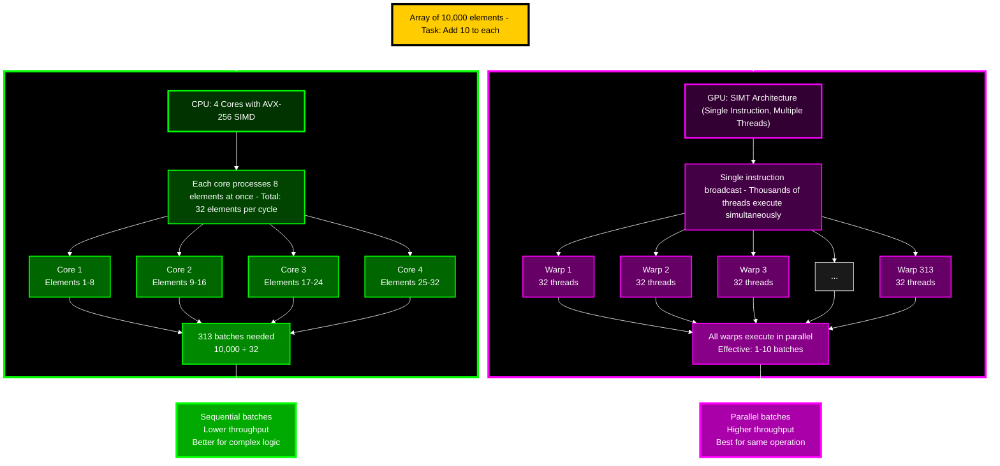

We all know Python is slow but everyone knows the secret to python programming is to try and avoid python at all cost and call a C/Rust binding beneath the hood.

Since we are all ML nerds let's take this a step further and use python to call gpu accelerated libraries or even write CUDA code. Many people know about using numpy for fast cpu operations and we know Pytorch allows you to easily put models on the gpu but it goes deeper than that.

If you are doing intense computations you don't need to feel that you can only write optimized cpu algorithms in python. You can utilize the speed of the gpu when you have algorithms suited for parallel processing.

# GPU vs CPU Recap





CPUs have very powerful cores and are responsible for managing a lot more than a GPU core. CPUs can handle many different types of operations, branchings, etc...

GPUs are have a lot of "dumb" cores that are really meant to process calculations and do operations in parallel. While CPUs have SIMD (Single Instruction Multiple Data) and can perform parallel operations they do not scale at the level GPUs do.

GPUs use SIMT (Single Instruction Multiple Threads) which as you can guess means they treat operations and parallel processing as a high priority.

You can go really deep into this topic but we want to look at how we can use this in our day to day lives as we are stuck in python land. The gist of this is that GPUs can perform calculations much quicker than a CPU can due to having more cores. There are some caveats such as the process needs to be non-blocking or no branching in order to take full advantage of the GPU.

CPUs can be faster than the GPU but if you have a operation that can be done in parallel then the GPU is much faster. This is why ML models run on GPUs since they are running thousands of matrix operations on repeat.

><span style="color: red; font-weight: bold;">⚠️ Warning:</span>
> Everything in this article assumes CUDA and Nvidia GPUs. I am sorry fellow AMD GPU owners. I am forever rooting for you

# CuPy

[CuPy](https://cupy.dev/) is a "drop in" replacement for numpy and scipy calls. It is a higher level library and if you have pure numpy or scipy algorithms being called it can be cheap to replace them with `CuPy`. For those that work in ML you may already have a large portion of numpy/scipy calls that could be ran on the GPU if you run into performance issues.

Like every gpu library in python it calls CUDA beneath the hood. This library is easy to use if all you are doing is drop in numpy replacements. Let's take some quick benchmarks. 

## Numpy vs CuPy

><span style="color: yellow; font-weight: bold;">These benchmarks are using a 285k i9 and 5090 RTX so speeds may vary for you</span>

We are going to benchmark three operations:

1) Matrix Multiplication

2) Element Wise Multiplication

3) Reduction Operations

```python
import numpy as np
import cupy as cp
import time
import matplotlib.pyplot as plt

def benchmark_operation(operation_name, numpy_func, cupy_func, sizes):
    """
    Benchmark a specific operation across different data sizes.
    
    Args:
        operation_name: Name of the operation
        numpy_func: Function that performs the operation with NumPy
        cupy_func: Function that performs the operation with CuPy
        sizes: List of data sizes to test
    
    Returns:
        Dictionary with timing results
    """
    results = {
        'sizes': sizes,
        'numpy_times': [],
        'cupy_times': [],
        'speedup': []
    }
    
    print(f"\n{'='*60}")
    print(f"Benchmarking: {operation_name}")
    print(f"{'='*60}")
    print(f"{'Size':<15} {'NumPy (ms)':<15} {'CuPy (ms)':<15} {'Speedup (x times faster)':<15}")
    print(f"{'-'*60}")
    
    for size in sizes:
        # NumPy timing
        start = time.time()
        _ = numpy_func(size)
        numpy_time = (time.time() - start) * 1000  # Convert to milliseconds
        
        # CuPy timing (with warm-up)
        _ = cupy_func(size)  # Warm-up run
        cp.cuda.Stream.null.synchronize()  # Wait for GPU to finish
        
        start = time.time()
        _ = cupy_func(size)
        cp.cuda.Stream.null.synchronize()  # Wait for GPU to finish
        cupy_time = (time.time() - start) * 1000  # Convert to milliseconds
        
        speedup = numpy_time / cupy_time
        if cupy_time > numpy_time:
            speedup *= -1
        
        results['numpy_times'].append(numpy_time)
        results['cupy_times'].append(cupy_time)
        results['speedup'].append(speedup)
        
        print(f"{size:<15} {numpy_time:<15.2f} {cupy_time:<15.2f} {speedup:<15.2f}")
    
    return results


# Define benchmark operations
def matrix_multiply_numpy(size):
    a = np.random.rand(size, size).astype(np.float32)
    b = np.random.rand(size, size).astype(np.float32)
    return np.dot(a, b)

def matrix_multiply_cupy(size):
    a = cp.random.rand(size, size, dtype=cp.float32)
    b = cp.random.rand(size, size, dtype=cp.float32)
    return cp.dot(a, b)

def element_wise_numpy(size):
    a = np.random.rand(size, size).astype(np.float32)
    b = np.random.rand(size, size).astype(np.float32)
    return a * b + np.sin(a) + np.cos(b)

def element_wise_cupy(size):
    a = cp.random.rand(size, size, dtype=cp.float32)
    b = cp.random.rand(size, size, dtype=cp.float32)
    return a * b + cp.sin(a) + cp.cos(b)

def reduction_numpy(size):
    a = np.random.rand(size, size).astype(np.float32)
    return np.sum(a), np.mean(a), np.std(a)

def reduction_cupy(size):
    a = cp.random.rand(size, size, dtype=cp.float32)
    return cp.sum(a), cp.mean(a), cp.std(a)
```

We warmup the gpu first to make sure we capture execution time and not other things like memory allocation, compiling kernels, etc...

The results show the obvious. GPU go burrrr

```

============================================================
Benchmarking: Matrix Multiplication (NxN x NxN)
============================================================
Size            NumPy (ms)      CuPy (ms)       Speedup (x times faster)
------------------------------------------------------------
100             0.58            0.06            9.12           
500             20.66           0.08            270.85         
1000            39.64           0.09            426.29         
5000            356.95          3.94            90.69          
10000           1844.69         30.13           61.22          

============================================================
Benchmarking: Element-wise Operations (a*b + sin(a) + cos(b))
============================================================
Size            NumPy (ms)      CuPy (ms)       Speedup (x times faster)
------------------------------------------------------------
100             0.32            0.06            5.19           
500             1.74            0.06            31.55          
1000            7.82            0.06            132.76         
5000            295.74          1.15            258.05         
10000           1184.07         5.57            212.57         

============================================================
Benchmarking: Reduction Operations (sum, mean, std)
============================================================
Size            NumPy (ms)      CuPy (ms)       Speedup (x times faster)
------------------------------------------------------------
100             0.31            0.12            2.70           
500             0.86            0.26            3.33           
1000            3.67            0.55            6.68           
5000            150.00          17.86           8.40           
10000           579.59          85.83           6.75           
```


Clearly for these operations you get some good speedups when using the GPU. You always have to weigh the viability of these benchmarks. Perhaps in your use case these speedups are not worth adding another dependency to your codebase. Another issue is you introduce complexity of managing if the servers or users have a GPU or not.

## Scipy vs CuPy

Now we will do something similar for Scipy vs CuPy. We will test the following operations

* FFT (Fast Fourier Transform)
* Linear Equations
* Sparse Matrix Multiplication
* Single Value Decomposition

```python
def benchmark_operation(operation_name, scipy_func, cupy_func, sizes):
    """
    Benchmark a specific operation across different data sizes.

    Args:
        operation_name: Name of the operation
        scipy_func: Function using SciPy (CPU)
        cupy_func: Function using CuPy / cupyx.scipy (GPU)
        sizes: List of problem sizes to test
    """
    results = {'sizes': sizes, 'scipy_times': [], 'cupy_times': [], 'speedup': []}

    print(f"\n{'='*70}")
    print(f"Benchmarking: {operation_name}")
    print(f"{'='*70}")
    print(f"{'Size':<15} {'SciPy (ms)':<15} {'CuPy (ms)':<15} {'Speedup (x times faster)':<15}")
    print(f"{'-'*70}")

    for size in sizes:
        # CPU timing
        start = time.time()
        _ = scipy_func(size)
        scipy_time = (time.time() - start) * 1000  # ms

        # GPU timing (warm-up + sync)
        _ = cupy_func(size)
        cp.cuda.Stream.null.synchronize()
        start = time.time()
        _ = cupy_func(size)
        cp.cuda.Stream.null.synchronize()
        cupy_time = (time.time() - start) * 1000  # ms

        speedup = scipy_time / cupy_time
        if cupy_time > scipy_time:
            speedup *= -1
        results['scipy_times'].append(scipy_time)
        results['cupy_times'].append(cupy_time)
        results['speedup'].append(speedup)

        print(f"{size:<15} {scipy_time:<15.2f} {cupy_time:<15.2f} {speedup:<15.2f}")

    return results

def scipy_fft(size):
    x = np.random.rand(size, size).astype(np.float32)
    return sp_fft.fft2(x)

def cupy_fft(size):
    x = cp.random.rand(size, size, dtype=cp.float32)
    return cp_fft.fft2(x)

def scipy_linalg_solve(size):
    X = np.random.rand(size, size).astype(np.float32)
    A = X.T @ X + np.eye(size, dtype=np.float32)
    b = np.random.rand(size).astype(np.float32)
    return sp_linalg.solve(A, b, assume_a='pos')

def cupy_linalg_solve(size):
    X = cp.random.rand(size, size, dtype=cp.float32)
    A = X.T @ X + cp.eye(size, dtype=cp.float32)
    b = cp.random.rand(size, dtype=cp.float32)
    return cp.linalg.solve(A, b)

def scipy_sparse_matmul(size):
    A = sp_sparse.random(size, size, density=0.01, format='csr', dtype=np.float32)
    B = sp_sparse.random(size, size, density=0.01, format='csr', dtype=np.float32)
    return A @ B

def cupy_sparse_matmul(size):
    A = cp_sparse.random(size, size, density=0.01, format='csr', dtype=cp.float32)
    B = cp_sparse.random(size, size, density=0.01, format='csr', dtype=cp.float32)
    return A @ B

def scipy_svd(size):
    X = np.random.rand(size, size).astype(np.float32)
    return sp_linalg.svd(X, full_matrices=False)

def cupy_svd(size):
    X = cp.random.rand(size, size, dtype=cp.float32)
    return cp.linalg.svd(X, full_matrices=False)

sizes = [100, 500, 512, 1024, 2048]

results_fft = benchmark_operation("FFT 2D", scipy_fft, cupy_fft, sizes)
results_solve = benchmark_operation("Linear Solve (A x = b)", scipy_linalg_solve, cupy_linalg_solve, sizes)
results_sparse = benchmark_operation("Sparse Matrix Multiply", scipy_sparse_matmul, cupy_sparse_matmul, sizes)
results_svd = benchmark_operation("Singular Value Decomposition", scipy_svd, cupy_svd, sizes)
```

Here are the results:

```

======================================================================
Benchmarking: FFT 2D
======================================================================
Size            SciPy (ms)      CuPy (ms)       Speedup (x times faster)
----------------------------------------------------------------------
100             0.24            0.11            2.11           
500             1.34            0.09            15.00          
512             1.77            0.07            23.90          
1024            8.17            0.09            86.12          
2048            38.33           0.15            262.27         

======================================================================
Benchmarking: Linear Solve (A x = b)
======================================================================
Size            SciPy (ms)      CuPy (ms)       Speedup (x times faster)
----------------------------------------------------------------------
100             0.53            0.39            1.36           
500             3.61            0.99            3.63           
512             2.57            0.96            2.68           
1024            105.51          2.00            52.79          
2048            171.70          4.84            35.48          

======================================================================
Benchmarking: Sparse Matrix Multiply
======================================================================
Size            SciPy (ms)      CuPy (ms)       Speedup (x times faster)
----------------------------------------------------------------------
100             0.81            2.37            -0.34          
500             4.51            3.55            1.27           
512             4.36            3.29            1.32           
1024            17.88           3.97            4.50           
2048            98.44           4.09            24.04          

======================================================================
Benchmarking: Singular Value Decomposition
======================================================================
Size            SciPy (ms)      CuPy (ms)       Speedup (x times faster)
----------------------------------------------------------------------
100             124.44          5.11            24.36          
500             735.54          30.26           24.30          
512             765.53          31.54           24.27          
1024            114.06          84.09           1.36           
2048            591.56          237.68          2.49              
```


><span style="color: yellow; font-weight: bold;">Values above 1 mean the GPU is faster. Below 1 means the CPU is faster</span>

Here we get some more interesting results. In the case of Sparse Matrix Multiplication it is slower with the smaller data points. The reason you see this with small data points is the overhead between data transfer from gpu to cpu. Another issue is with the sparse multiplication with a density of 0.01. This means most of the values are 0.

These matrices are not laid out well for parrallel processing. CSR format stores data as:

1) data: actual non-zero values
2) indices: column positions of non-zeros
3) indptr: pointers to where each row starts

When GPU threads process rows in parallel:

1) Thread 0 reads indices[0] → jumps to random column position
2) Thread 1 reads indices[1] → jumps to different random position
3) Thread 2 reads indices[2] → another random jump

This creates scattered memory access and makes it difficult for the SIMT instructions that GPUs are built on.

Eventaully with larger samples the speed of the GPU will blow past the CPU for sparse multiplication

**SVD (Single Value Decomposition)** is faster at the smaller size but then the margin gets thinner and the CPU times start getting close to the GPU. It is still faster on the GPU but the gap closes.

The reason is that SVD is not an easy algorithm to parrallelize. Also there has been a lot of work optimizing SVD on the CPU and using the CPU cache blocks.

SVD uses QR iterations where each step needs wait for the previous one. Now there are still parts of this algorithm that can be done is parrallel which is why the GPU is still faster but parts of the algorithm have the wait. This [repo](https://github.com/emchinn/bidiagonalization-golub-kahan/blob/master/Golub-Kahan.ipynb) has a good example of the algorithm.

This [article](https://gregorygundersen.com/blog/2018/12/10/svd/) explains SVD in a way that is easier to comprehend than the traditional mathmatical definition.

from the [wiki](https://en.wikipedia.org/wiki/Singular_value_decomposition) 

>The SVD of a matrix⁠ is typically computed by a two-step procedure. In the first step, the matrix is reduced to a bidiagonal matrix.⁠The second step is to compute the SVD of the bidiagonal matrix. This step can only be done with an iterative method

You can do the bidiagonalization in parallel but when you get to the sequential part you have to wait and there is nothing the GPU can do there. Due to these factors and the algorithm not being fully parralellized CPUs are able to complete this algorithm in similiar speeds. While the GPU is still faster this just goes to show that the GPU is not suited for all algorithms.

