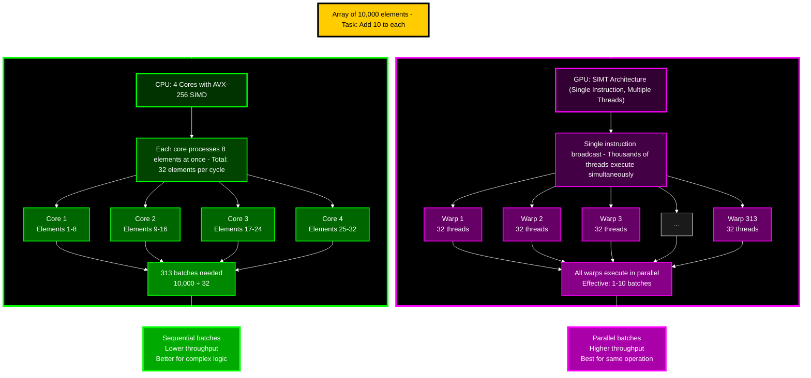

We all know Python is slow but everyone knows the secret to python programming is to try and avoid python at all cost and call a C/Rust binding beneath the hood.

Since we are all ML nerds let's take this a step further and use python to call gpu accelerated libraries or even write CUDA code. Many people know about using numpy or fast cpu operations and we know Pytorch allows you to easily put models on the gpu but it goes deeper than that.

If you are doing intense computations you don't need to feel that you can only write optimized cpu algorithms in python. You can utilize the speed of the gpu when you have algorithms suited for parallel processing.

# GPU vs CPU Recap





CPUs have very powerful cores and are responsible for managing a lot more than a GPU core. CPUs can handle many different types of operations, branchings, etc...

GPUs are have a lot of "dumb" cores that are really meant to process calculations and do operations in parallel. While CPUs have SIMD (Single Instruction Multiple Data) and can perform parallel operations they do not scale at the level GPUs do.

GPUs use SIMT (Single Instruction Multiple Threads) which as you can guess means they treat operations and parallel processing as a high priority.

You can go really deep into this topic but we want to look at how we can use this in our day to day lives as we are stuck in python land. The gist of this is that GPUs can perform calculations much quicker than a CPU can due to having more cores. There are some caveats such as the process needs to be non-blocking or no branching in order to take full advantage of the GPU.

CPUs can be faster than the GPU but if you have a operation that can be done in parallel then the GPU is much faster. This is why ML models run on GPUs since they are running thousands of matrix operations on repeat.

# CuPy

[CuPy](https://cupy.dev/) 