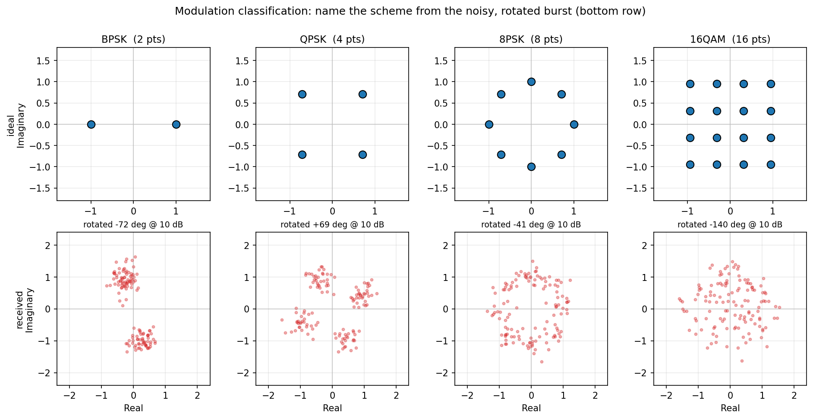
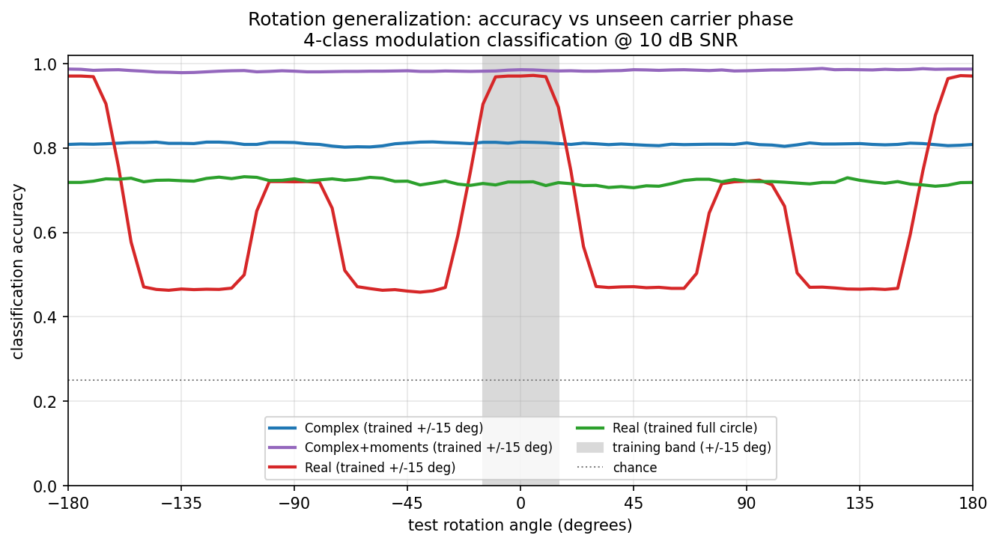

# Complex vs. Real Neural Networks for IQ Signals

Code for the blog post comparing **complex-valued** neural networks against
**split-real** (I/Q-as-two-channels) baselines on radio-frequency IQ data.

The headline question: *when does a complex-valued network actually beat a
real one?* The answer here is **rotation equivariance**. Complex linear
layers commute with a global phase rotation for free; a real network has to
*learn* that symmetry from data. We pick a task where that property is the
whole game and measure the gap.

## Setup

```bash
conda activate blog-code-examples           # numpy, torch, matplotlib
cd code_examples/complex_vs_real_nn
```

Training/evaluation use PyTorch (CUDA if available) and TorchSig for IQ burst
generation, carrier phase rotation, and AWGN. Plotting uses numpy + matplotlib.

---

## The experiment: rotation-invariant modulation classification

**Task.** Classify which modulation produced a noisy IQ burst — BPSK, QPSK,
8PSK, or 16QAM — under an *unknown carrier phase* (a global rotation of the
constellation). The modulation type is a **rotation-invariant** property: the
answer does not change when you rotate the whole burst.



**The trick that exposes the difference.** We train on a *narrow* rotation band
(θ ∈ ±15°) and test across the *full circle*.

- `ComplexModClassifier` — bias-free `ComplexConv1d` + `modReLU` (each exactly
  rotation-equivariant) finished with a **magnitude pool** (mean/std of `|h|`).
  The whole network is rotation-**invariant by construction**, having seen only
  ±15° in training.
- `ComplexMomentClassifier` — the same equivariant complex feature extractor,
  but with an invariant moment head: magnitude stats plus
  `|mean(unit_phase^2)|`, `|mean(unit_phase^4)|`, and `|mean(unit_phase^8)|`.
  This keeps exact rotation invariance while exposing the cyclic structure that
  separates BPSK/QPSK/8PSK.
- `RealModClassifier` — split-I/Q `Conv1d` + BN + ReLU with stats pooling. It
  can only learn invariance over rotations it was *trained on*.

A third run trains the real net on the **full circle** (`real_full`) to show it
*can* recover invariance — but only by paying for it with augmentation.

### Result



| run | in-band acc (±15°) | full-circle acc | gap |
|-----|-----:|-----:|-----:|
| **complex_narrow** | 0.762 | **0.754** | **+0.007** |
| complex_moment | train this run to update results | train this run to update results | -- |
| real_narrow | 0.970 | 0.631 | +0.339 |
| real_full | 0.730 | 0.728 | +0.002 |

Reading the plot:

- **Complex (blue)** is flat across all 360° — invariant by design, despite
  training on a 24×-narrower band than `real_full`.
- **Real-narrow (red)** hits 0.97 *in-band* (a deceptive number) and collapses
  to 0.45 on unseen rotations. Its peaks land exactly on each constellation's
  rotational symmetry angles (BPSK 180°, QPSK 90°, 8PSK 45°, 16QAM 90°) — see
  `rotation_per_modulation.png` and `confusion_in_vs_ood.png`.
- **Real-full (green)** recovers a flat curve, but the complex net trained on
  ±15° still edges it out over the full circle.

The complex net's invariance is *free and exact*; the real net needs full-circle
data to approximate it.

### Honest caveat

The plain magnitude pool that buys exact invariance also discards the higher-order
phase moment (`E[z⁴]`) that separates the two **constant-modulus** alphabets,
so the complex net confuses QPSK↔8PSK (both unit-circle). BPSK and 16QAM are
near-perfect. This is a genuine representation/invariance tradeoff, discussed in
the post. The `complex_moment` run tests that richer invariant directly.

In plain language: if you only look at "how far points are from the origin"
you become perfectly rotation-robust, but you also throw away the subtle angular
pattern that tells QPSK and 8PSK apart. The `complex_moment` head adds that
missing phase-structure signal back while staying rotation-invariant.

### Run guide (single notebook)

From the repository root:

```bash
conda activate blog-code-examples
python -m pip install -r code_examples/requirements.txt
cd code_examples/complex_vs_real_nn
```

Open the notebook:

```bash
jupyter notebook complex_vs_real_nn.ipynb
```

The notebook is the primary workflow and is organized into sections for:
- environment and configuration
- intuition plots (`modclass_constellations.png`, `modclass_rotation_nuisance.png`)
- data and model sanity checks
- training runs (`complex_moment`, `complex_narrow`, `real_narrow`, `real_full`)
- evaluation sweeps and figure generation
- summary table and JSON export

Expected outputs created by the notebook:
- `trained_modclass/<run>/best_model.pt`
- `trained_modclass/<run>/metrics.json`
- `trained_modclass/<run>/training_curves.png`
- `trained_modclass/<run>/train.log`
- `results/rotation_sweep_notebook.json`
- `visualizations/modclass_constellations.png`
- `visualizations/modclass_rotation_nuisance.png`
- `visualizations/rotation_generalization.png`
- `visualizations/rotation_per_modulation.png`
- `visualizations/snr_sweep_modclass.png`
- `visualizations/confusion_in_vs_ood.png`

Quick smoke-test workflow inside the notebook:
- set `FAST_MODE = True`
- keep `epochs = 1..5`
- reduce eval sample counts (`n=200..1000`)
- switch back to `FAST_MODE = False` for final numbers

Optional CLI parity (same underlying modules):

```bash
python modclass_cli.py viz
python modclass_cli.py train
python modclass_cli.py eval
```

---

## Files

| Path | Purpose |
|------|---------|
| `config.py` | Experiment configuration (`ModClassConfig`) and shared defaults. |
| `training.py` | Training loops, loaders, checkpoints, and training CLI logic. |
| `evaluation.py` | Evaluation sweeps, metrics, and eval CLI logic. |
| `plotting.py` | Figure generation for the visualization and evaluation workflows. |
| `data.py` | TorchSig-backed burst generation, rotation/AWGN helpers, and dataset construction. |
| `models.py` | Complex and real model definitions plus the model factory. |
| `modclass_core.py` | Backward-compatible shim that re-exports the refactored API. |
| `modclass_cli.py` | Thin CLI wrapper that dispatches to the training/evaluation/plotting modules. |
| `train.py` | Thin wrapper for the CLI (`viz`, `train`, `eval`). |
| `complex_vs_real_nn.ipynb` | Main end-to-end notebook workflow for setup, training, evaluation, and plots. |

## Key figures (`visualizations/`)

| File | What it shows |
|------|---------------|
| `modclass_constellations.png` | The four alphabets: ideal vs noisy/rotated received bursts. |
| `modclass_rotation_nuisance.png` | One label, different I/Q pattern per carrier phase. |
| `rotation_generalization.png` | **The money plot** — accuracy vs unseen rotation for available trained runs. |
| `rotation_per_modulation.png` | Real-net dips trace each constellation's rotational symmetry. |
| `snr_sweep_modclass.png` | Full-circle accuracy vs SNR. |
| `confusion_in_vs_ood.png` | Confusion matrices, in-band vs out-of-distribution rotation. |
